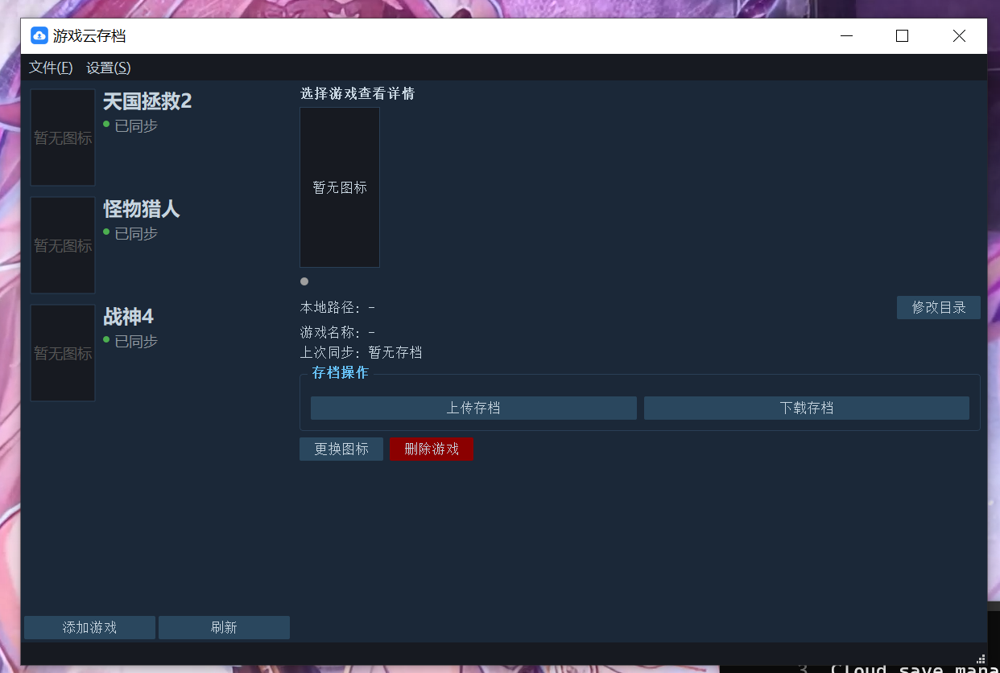

# Game Saving Cloud

Cloud save manager for games — backup and restore game saves with a server/client architecture.

[中文](README.md)

## Architecture

```
Server (FastAPI)  ←→  Client (PySide2 Qt5)
     Port 3000            Desktop GUI
```

- **Server**: REST API, SQLite storage, filesystem-based zip save storage
- **Client**: Game list + detail panel, one-click upload/download saves

## Screenshot



## Installation

```bash
pip install -r requirements.txt
```

## Running

**Server:**

```bash
# Direct run
python -m server.main

# Or via uvicorn
uvicorn server.main:app --host 0.0.0.0 --port 3000
```

**Client:**

```bash
python -m client.main
```

In the client, go to **Settings → Server Configuration** to set the server IP address.

## Configuration

Server settings via environment variables (prefix `GSC_`):

| Variable | Default | Description |
|---|---|---|
| `GSC_HOST` | `0.0.0.0` | Listen address |
| `GSC_PORT` | `3000` | Listen port |
| `GSC_DATABASE_URL` | `sqlite+aiosqlite:///./server/data/game_saves.db` | SQLite path |
| `GSC_STORAGE_ROOT` | `./server/storage` | Save file storage directory |
| `GSC_MAX_UPLOAD_SIZE_MB` | `500` | Max upload size (MB) |
| `GSC_LOG_LEVEL` | `INFO` | Log level |

## Building

```bash
python build.py           # Server
python build.py client    # Client
```

Output goes to the `dist/` directory. Uses PyInstaller with `--onedir` mode.

## Deploy Server (Linux systemd)

```bash
sudo tee /etc/systemd/system/game-save-cloud.service << 'EOF'
[Unit]
Description=Game Save Cloud
After=network.target

[Service]
Type=simple
WorkingDirectory=/home/allen/game_save_cloud/dist/game-save-server
ExecStart=/home/allen/game_save_cloud/dist/game-save-server/game-save-server
Restart=always
RestartSec=3

[Install]
WantedBy=multi-user.target
EOF

sudo systemctl enable --now game-save-cloud
```

## API

| Method | Path | Description |
|---|---|---|
| GET | `/api/health` | Health check |
| GET | `/api/games` | List games |
| POST | `/api/games` | Create game |
| GET | `/api/games/{id}` | Get game detail |
| PUT | `/api/games/{id}` | Update game |
| DELETE | `/api/games/{id}` | Delete game |
| PUT | `/api/games/{id}/icon` | Upload icon |
| GET | `/api/games/{id}/icon` | Download icon |
| POST | `/api/games/{id}/saves` | Upload individual save |
| GET | `/api/games/{id}/saves` | List saves for game |
| GET | `/api/saves/{id}/download` | Download individual save |
| DELETE | `/api/saves/{id}` | Delete save |
| PUT | `/api/games/{id}/save` | Upload game save zip |
| GET | `/api/games/{id}/save/download` | Download game save zip |
